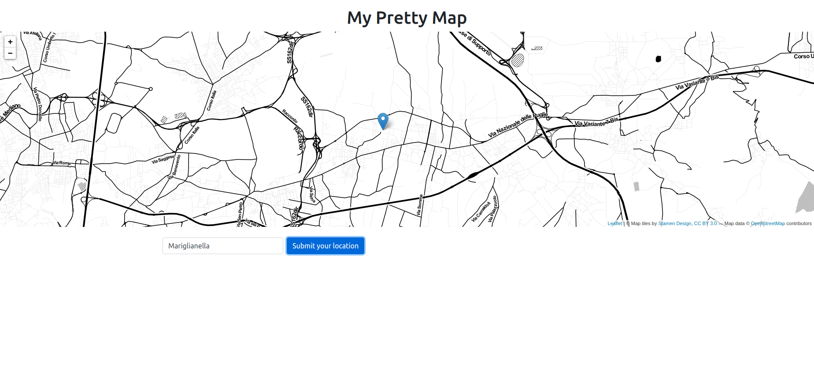

# Demo ANSOL

The purpose of this project is to show a minimal example, of how-to use Leaflet whithin React.

[Leaflet](https://leafletjs.com/) is an open-source JavaScript library for building interactive maps.

This project uses the [react-leaflet](https://www.npmjs.com/package/react-leaflet) library, which packages Leaflet into React components.

Please take some time to get familiar with the react-leaflet library, and with Leaflet itself, by reading the documentation.

On the github repository of the project, you will find a folder with [examples](https://github.com/PaulLeCam/react-leaflet/tree/c13eeadddd06902c34988493ec1d84616a27d486/example)

To support geocoding, the [open cage API client](https://www.npmjs.com/package/opencage-api-client) is used. [OpenCage](https://opencagedata.com/) is an easy, open, worldwide, affordable API to convert coordinates to and from places. Take some time to read the OpenCage [FAQ](https://opencagedata.com/faq). In order to use OpenCage, you will need to sign up for an API key.

## INSTALL

First [sign up](https://opencagedata.com/users/sign_up) to get a free API key from OpenCage.
Then create an environment variable with your API Key:

``` bash
export REACT_APP_OCD_API_KEY=[Your-api-key]
```

Run this application with yarn:

``` bash
yarn
yarn start
```

Then open it on a browser, at: 

http://localhost:5000



## Use

You can use this application to add points to the map. The application will read any address, city or postcode as a string, and display it as a marker on the map. 

To try it out, input any address into the input box. The map bounds will be adjusted to display this point, using a flying animation. You can try it with the coordinates of any other location (in WGS84) in the earth's surface.

You can also use this application to add markers to the map, just by clicking in the map's surface.